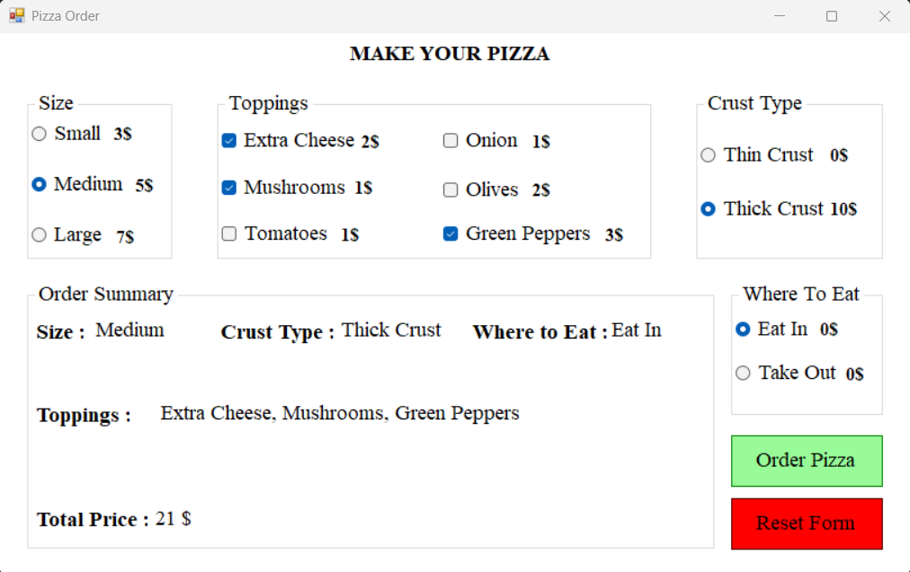

# 🍕 Pizza Order App

A Windows Forms desktop application built with C# that allows users to customize and place a pizza order with real-time price calculation.

## ✨ Features

- **Size Selection** – Choose between Small ($3), Medium ($5), or Large ($7)
- **Toppings** – Pick from Extra Cheese, Mushrooms, Tomatoes, Onion, Olives, and Green Peppers
- **Crust Type** – Thin Crust (free) or Thick Crust ($10)
- **Where To Eat** – Eat In or Take Out
- **Live Price Calculation** – Total price updates instantly with every selection
- **Order Summary** – Displays a full summary before confirming
- **Order Confirmation** – Confirm or cancel the order with a dialog box
- **Reset Form** – Clear all selections and start a new order

## 🖥️ Screenshot

## 🛠️ Built With

- C# / .NET
- Windows Forms (WinForms)

